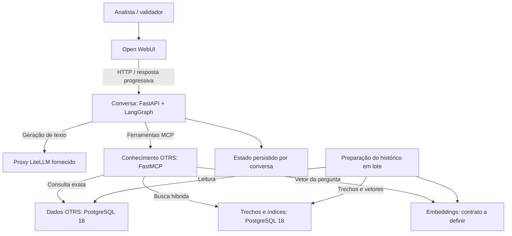

# Arquitetura inicial — MVP 0.1

Status: proposta para discussão, ainda não implementada. O [escopo da 0.1](mvp-0.1.md) está confirmado; as escolhas técnicas abaixo são recomendações para realizá-lo.

## 1. Direção

Manter a stack da [idealização](ideacao.md): Open WebUI, FastAPI, LangGraph, FastMCP e PostgreSQL 18 com pgvector e BM25. Consumir o proxy LiteLLM fornecido ao projeto; a implantação do LLM não pertence a esta arquitetura.

Separar consulta exata de ticket e busca por similaridade. Cada módulo esconde sua complexidade atrás de uma interface pequena: o módulo de conversa não precisa conhecer joins do OTRS, segmentação ou SQL de ranking.

São dependências lógicas: não é necessário um processo por módulo. A proposta inicial tem interface web, backend de conversa, processo MCP e rotina de preparação em lote, reutilizando o banco existente.

## 2. Módulos e interfaces propostas

Os nomes abaixo são contratos de projeto, não métodos implementados.

| Módulo | Interface proposta | Complexidade interna |
| --- | --- | --- |
| Conversa | responder(conversa, mensagem) → eventos | Contexto, intenção, filtro, ferramentas e separação de evidências/sugestões |
| Conhecimento OTRS | consultar_ticket(numero, pergunta?), buscar_casos(pergunta, filas?), resolver_filas(texto) | Esquema OTRS, SQL, cronologia, recuperação híbrida, fontes e limites de contexto |
| Preparação do histórico | preparar(snapshot, configuracao) → relatório | Limpeza, segmentação, embeddings, deduplicação e índices derivados |

O endpoint HTTP e o transporte MCP são adapters das interfaces desses módulos. SQL e recuperação ficam na implementação de Conhecimento OTRS, compartilhada pelo transporte MCP e pelas verificações de integração. Evitar interfaces genéricas para fornecedores hipotéticos.

Conhecimento OTRS retorna ticket, fila, situação, mensagens pertinentes, identificadores das fontes e indicação de cobertura/truncamento. Distinguir ticket não encontrado, fila ambígua e falha técnica.

Proposta em relação ao Markdown mencionado na idealização: conservar campos estruturados no contrato MCP e gerar Markdown na apresentação. Isso permite conferir fontes sem interpretar novamente uma resposta textual. Validar o formato no teste do transporte MCP.

## 3. Dois caminhos de consulta

### Ticket por número

O DDL inspecionado identifica ticket.tn como número público único e ticket.id como identificador interno. Consultar o número público por correspondência exata e preservá-lo como texto; não usar similaridade para escolher qual ticket foi informado.

Relacionamentos identificados: ticket.queue_id → queue.id, article.ticket_id → ticket.id e article_data_mime.article_id → article.id. Assunto e corpo estão em article_data_mime.a_subject e a_body. article.is_visible_for_customer registra visibilidade; notas internas fazem parte da validação individual.

Organizar mensagens cronologicamente. Para tickets maiores que o orçamento de contexto, sintetizar por partes conservando as fontes. Perguntas específicas podem recuperar trechos daquele ticket. Não apresentar leitura parcial como se cobrisse todo o atendimento.

Resumir problema, tentativas, solução documentada e situação. Status fechado não basta como evidência de solução. A consulta explícita ignora o filtro de pesquisa, informa a fila do ticket e preserva o filtro para buscas seguintes.

### Casos semelhantes

Usar o contexto da conversa para entender a dúvida e resolver o filtro de filas antes de buscar. Aplicar o filtro às buscas lexical e semântica, combinar candidatos e reunir trechos com suas fontes.

Como hipótese inicial, usar fusão por posição (RRF), evitando somar diretamente escores de naturezas diferentes. Quantidade de candidatos, trechos enviados ao LLM e parâmetros de segmentação dependem da avaliação; não são constantes aprovadas.

Falha técnica deve ser reportada como indisponibilidade. Resultados insuficientes exigem explicação do alcance da busca e, quando necessário, esclarecimento. Casos com soluções diferentes conservam seus contextos e referências.

## 4. Preparação e embeddings

Criar tabelas derivadas separadas das tabelas OTRS. Ler a cópia fixa, extrair títulos/mensagens/notas, normalizar HTML e segmentar sem perder a referência à mensagem original. Não processar anexos.

Cada trecho deve preservar número e ID do ticket, ID da mensagem, fila, data, posição no texto, versão de processamento e modelo de embeddings. Manter evidências conferíveis e um relatório de textos vazios, falhas de conversão, quantidades e cobertura de filas.

Permitir retomada da preparação sem duplicações. Não misturar vetores de modelos ou dimensões diferentes. Usar a mesma configuração de embeddings em documentos e perguntas, respeitando os formatos de entrada do modelo escolhido.

**Em aberto:** modelo e execução dos embeddings. O acesso ao LLM pelo LiteLLM não comprova disponibilidade de embeddings no proxy. Definir contrato, dimensão e adequação ao português/textos técnicos antes da coluna vetorial e dos índices. Não assumir endpoint nem instalar um modelo local sem essa definição.

## 5. Conversa e persistência

A UI apresenta o histórico; o backend conserva fila selecionada, ticket em foco, esclarecimentos pendentes e referências necessárias aos acompanhamentos.

Proposta: histórico visível persistido pela UI e estado do grafo persistido por conversa, separado dos dados OTRS. O LangGraph documenta checkpoints identificados por thread_id, inclusive com persistência PostgreSQL. A integração precisa ser testada no projeto. [Referência oficial do LangGraph](https://reference.langchain.com/python/langgraph/checkpoints).

Validar a ligação entre um identificador estável do chat e o estado do backend. Não presumir que aceitar /v1/chat/completions encaminha automaticamente essa identidade. Se necessário, uma extensão pequena da UI pode encaminhá-la. A conexão compatível com OpenAI não resolve sozinha esse contrato específico de estado. [Documentação de conexões da Open WebUI](https://docs.openwebui.com/getting-started/quick-start/connect-a-provider/starting-with-openai-compatible/).

Definir a origem autoritativa das mensagens, evitar duplicação quando a UI reenviar histórico e identificar novas tentativas da mesma requisição. Verificar retomada após fechar a interface e reiniciar o backend, além de chats simultâneos com filas/tickets distintos.

## 6. Geração, evidências e streaming

Configurar URL base, credencial e alias do modelo do proxy. Validar alcance, requisição, streaming e capacidades de ferramentas antes de depender delas. Não presumir que o alias seja o nome original do Qwen.

O módulo de conversa chama apenas ferramentas de leitura previstas no contrato. Não expor SQL livre. Textos dos tickets são evidências, sem autoridade para modificar instruções ou acionar ferramentas.

Sinalizar processamento, coletar evidências e transmitir progressivamente a resposta final. Associar referências a fontes efetivamente retornadas; montar metadados a partir das consultas sem deixar o modelo inventar números ou datas.

Separar ausência de solução documentada e sugestão externa em seções distintas. Pedir esclarecimento quando faltar contexto essencial. Não converter uma falha de transporte, banco ou embeddings em uma resposta aparentemente fundamentada.

## 7. Verificações por interface

- Conhecimento OTRS: número público versus ID, ticket inexistente, fontes conferíveis, filtros nas duas buscas, fila ambígua, soluções conflitantes e tickets extensos.
- Preparação: retomada sem duplicação, rastreabilidade e detecção de vetores incompatíveis.
- Conversa: dois fluxos, filtro preservado após ticket de outra fila, retomada, isolamento e sugestões externas identificadas.
- Integração real: UI → backend → proxy; backend → MCP → PostgreSQL; erros e streaming. Verificar recuperação real sobre a base fixa.
- Aceite: conjunto de 20 perguntas do MVP, com qualidade, tempos e conferência das fontes.

## 8. Próximas decisões técnicas

1. Validar o contrato do proxy e o encaminhamento da identidade da conversa pela UI.
2. Detalhar a consulta exata, fontes e limites para tickets extensos.
3. Definir embeddings e trechos; depois especificar índices e ranking.
4. Fechar a persistência e o tratamento de retomada/reenvio de mensagens.
5. Converter as etapas do MVP em tarefas com evidência de conclusão.

Esta proposta não executou consultas aos registros dos tickets nem validou o proxy ou a UI. As informações sobre a cópia do banco vêm da documentação existente; os relacionamentos foram conferidos no DDL. Os pontos em aberto são escolhas técnicas a resolver no detalhamento.
