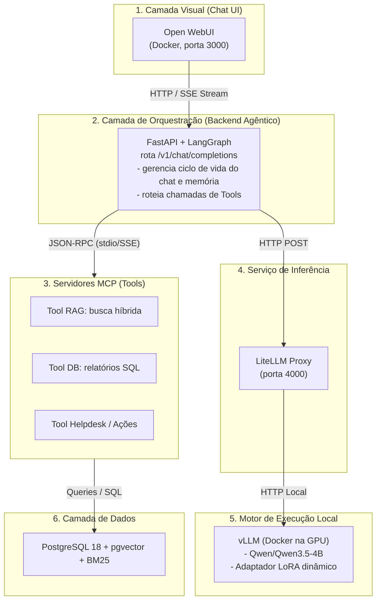

# Idealização do Projeto

> Rascunho evolutivo. Registra a visão, a arquitetura e as fases de construção, e será complementado com os requisitos do sistema e um guia de desenvolvimento.

## 1. Visão

Construir um assistente de chat local e privado (on-premise) integrado ao banco do OTRS, que:

- Rode com inferência **local** (sem depender de APIs externas), usando o **Qwen/Qwen3.5-4B** (padrão) servido pelo **vLLM**.
- Padronize o acesso ao modelo por um proxy (**LiteLLM**) com o formato `/v1/chat/completions`.
- Exponha capacidades (busca por contexto, relatórios, ações de helpdesk) como **ferramentas MCP** que o agente decide usar conforme a conversa.
- Seja orquestrado por um backend agêntico (**FastAPI + LangGraph**) que gerencia sessão, memória e o roteamento das tools, entregando a resposta por **SSE (streaming)** para a interface (**Open WebUI**).
- Use **PostgreSQL 18 + pgvector + pg_textsearch (BM25)** como camada de dados, reunindo dados operacionais (tickets), busca semântica (embeddings) e busca lexical.
- Evolua do modelo base para um **LoRA fine-tuned**, com validação empírica (teste A/B) do ganho na invocação das ferramentas.

## 2. Contexto e motivação

O diretório atual contém os artefatos de migração do OTRS de MariaDB para PostgreSQL:

- `BackpOtrs.sql` — dump do banco original (MariaDB 10.2, ~2,5 GB, 195 tabelas).
- `restore.sh` — restaura o dump em um MariaDB 10.11 isolado (Docker).
- `migrate.sh` — converte MariaDB → PostgreSQL 15 via `pgloader`.
- `verify.py` — valida contagens de registros e totais de bytes binários.

O PostgreSQL 15 migrado contém os dados OTRS e é a fonte validada para relatórios e contexto. Há também um [PostgreSQL 18 com pgvector e BM25](postgres18.md) preparado para a aplicação RAG; ele ainda não recebeu esses dados. O projeto de chat **herda** o trabalho de migração: os dados precisam estar acessíveis e corretos antes de expormos tools sobre eles.

## 3. Arquitetura

### Fluxo resumido

1. O usuário conversa na **Open WebUI**.
2. A UI envia a mensagem à API **FastAPI + LangGraph** (formato OpenAI).
3. O agente decide: responder direto ou acionar uma **tool MCP** (RAG, relatório, ação).
4. Para gerar texto, o agente chama o **LiteLLM**, que encaminha ao **vLLM** (modelo Qwen, com LoRA opcional).
5. As tools consultam o **PostgreSQL 18 + pgvector + BM25** e devolvem dados estruturados.
6. A resposta final é transmitida de volta por **SSE** e renderizada em tempo real.

## 4. Objetivos

- Operar o chat **totalmente local**, sem vazamento de dados para serviços externos.
- Padronizar todas as entradas de modelo pelo endpoint `/v1/chat/completions`.
- Isolar regras de negócio em **tools MCP** reutilizáveis e testáveis.
- Ensinar um modelo pequeno a chamar as tools corretamente, e provar o ganho com **LoRA** via teste A/B.

## 5. Escopo

### 5.1 Dentro do escopo

- Infraestrutura local: PostgreSQL 18 + pgvector + BM25, vLLM, LiteLLM, Open WebUI, FastAPI + LangGraph, servidores MCP.
- Tools: RAG, relatórios SQL e ações de helpdesk.
- Streaming (SSE) e memória de sessão.
- Dataset e fine-tuning LoRA (QLoRA) do modelo base.

### 5.2 Fora do escopo

- Integração com LLMs externos/em nuvem (o foco é local).
- Migração/reversão automática de dados (já coberta pelos scripts existentes).
- Validação funcional completa do OTRS (fica com os scripts de migração).

## 6. As 4 Fases de Desenvolvimento e Aprendizado

Regra fundamental: **desenvolver em ciclos incrementais** e não avançar para o fine-tuning antes de ter RAG e MCP funcionando com o modelo base.

### Fase 1 — Motor Local e Camada de Dados

**Objetivo:** subir o modelo e o banco sem código complexo de agentes.

1. Subir o PostgreSQL 18 com `pgvector` e `pg_textsearch` (BM25) via Docker; a instalação das extensões foi validada, e os dados OTRS ainda precisam ser copiados antes de consultas sobre tickets nesse banco.
2. Subir o vLLM via Docker com o `Qwen/Qwen3.5-4B` (padrão; alternativas 2B/0.8B ou AWQ 4-bit ficam para validação posterior).
3. Colocar o LiteLLM na frente do vLLM para padronizar o endpoint `/v1/chat/completions`.
4. Conectar o Open WebUI direto no LiteLLM e validar inferência local + streaming.

### Fase 2 — Construção do Servidor MCP (Tools e RAG)

**Objetivo:** isolar regras de negócio e consultas em um contrato universal.

1. Criar um servidor MCP em Python com **FastMCP**.
2. **Tool de RAG:** recebe a dúvida, combina busca semântica por similaridade de cosseno (`pgvector`) e busca lexical BM25 (`pg_textsearch`) e retorna Markdown estruturado.
3. **Tool de Relatórios:** executa agregações SQL direto nas tabelas operacionais e devolve métricas resumidas (tickets por categoria, tempo médio de atendimento, etc.).
4. Testar cada tool isoladamente via CLI para garantir os payloads esperados.

### Fase 3 — Orquestrador LangGraph (O Agente)

**Objetivo:** ensinar o fluxo a escolher as tools conforme o contexto da conversa.

1. Criar uma API **FastAPI** que aceite o formato OpenAI (`/v1/chat/completions`).
2. Dentro do endpoint, instanciar um grafo no **LangGraph** conectado como cliente ao servidor MCP.
3. Pergunta genérica → resposta direta; pedido de relatório/procedimento → `tool_call` para o MCP correspondente.
4. Implementar retorno por **SSE** para o Open WebUI renderizar em tempo real.
5. Apontar o Open WebUI para a API FastAPI (em vez do LiteLLM).

### Fase 4 — Fine-Tuning com LoRA e Validação Empírica

**Objetivo:** modificar o comportamento do modelo pequeno e provar o ganho de acurácia nas tools.

1. **Cenário de falha:** testar o modelo base chamando as tools e documentar onde erra (parâmetros inventados, esquecer a tool de relatório, formato solto em vez de JSON estrito).
2. **Dataset:** montar JSONL com 300–600 exemplos de conversas focadas no formato exato das tools MCP (quando chamar, como estruturar argumentos, como sintetizar a resposta).
3. **Treino:** usar **Unsloth** (Colab ou GPU local) para treinar um adaptador **LoRA** leve em 4 bits (**QLoRA**).
4. **Deploy dinâmico:** subir o vLLM com `--enable-lora` apontando para o adaptador treinado.
5. **Teste A/B:** script com ~30 perguntas desafiadoras comparando:
   - **Qwen3.5-4B Base:** taxa de erro na chamada das tools e tamanho do prompt necessário.
   - **Qwen3.5-4B + LoRA:** taxa de sucesso na invocação e respeito estrito ao schema.

## 7. Regra de desenvolvimento e aprendizado

- **Tudo em etapas.** Nenhuma fase começa antes da anterior estar validada e entendida.
- **Explicar o "porquê" de cada peça.** Cada componente (MCP, RAG, embeddings, LoRA, fine-tuning, vLLM, LiteLLM, LangGraph) será estudado e documentado antes/ao longo da implementação, com o conceito por trás e o motivo de existir na arquitetura.
- **Acompanhamento sem perder detalhes.** Cada etapa será registrada no guia de desenvolvimento com o passo, o conceito e a justificativa, para consolidar o aprendizado do ecossistema de IA.
- **Validação empírica antes de avançar.** Só seguimos quando houver evidência (teste passando, payload correto, métrica comparável).

## 8. Riscos e premissas

- Hardware para vLLM em GPU; o `Qwen3.5-4B` (BF16) precisa caber na GPU disponível.
- Qualidade dos dados migrados e disponibilidade das tabelas para as tools.
- Comportamento do modelo base pode variar; o fine-tuning é um refinamento, não a fundação.

## 9. Próximos passos

1. Levantar os requisitos do sistema (hardware, dados, modelos, bibliotecas).
2. Escrever o guia de desenvolvimento detalhado (com conceitos e justificativas).
3. Iniciar a Fase 1.
